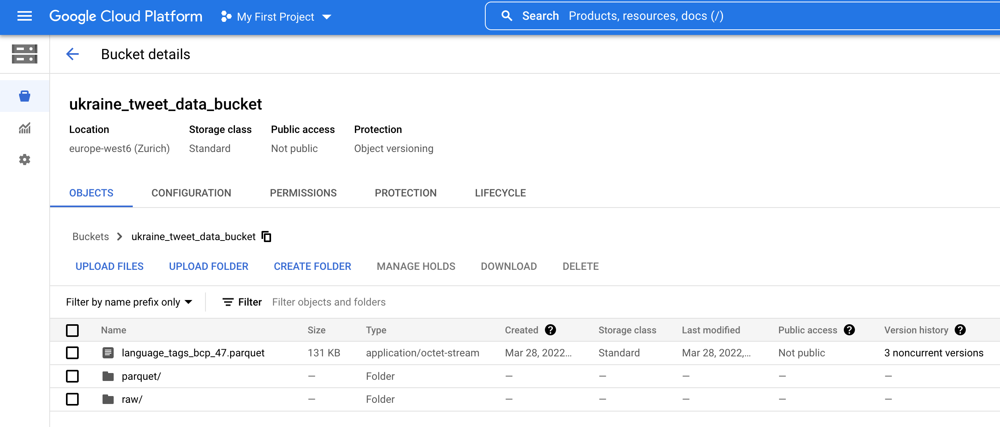
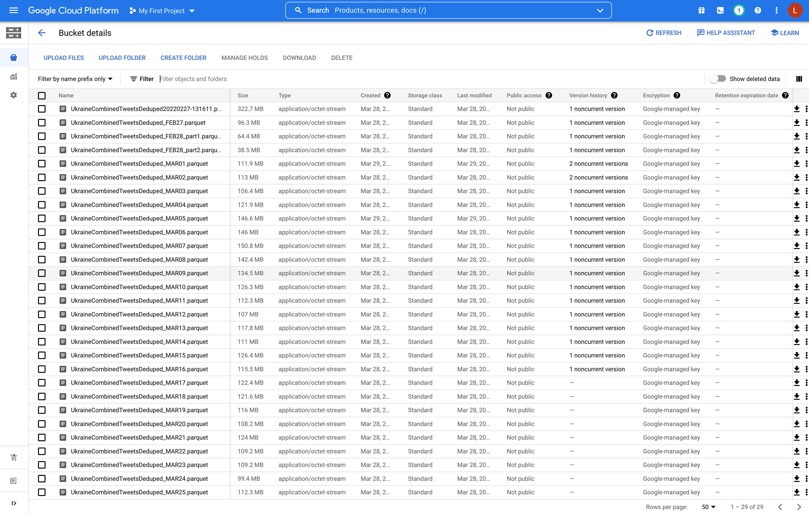
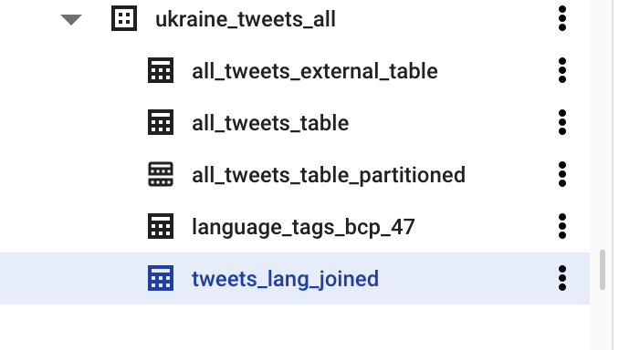
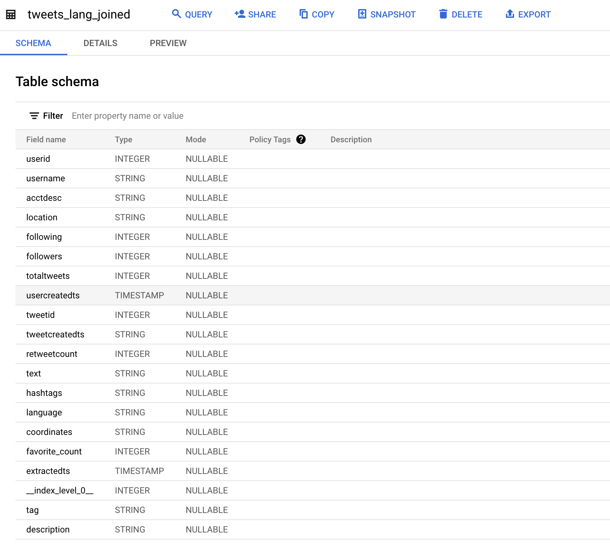
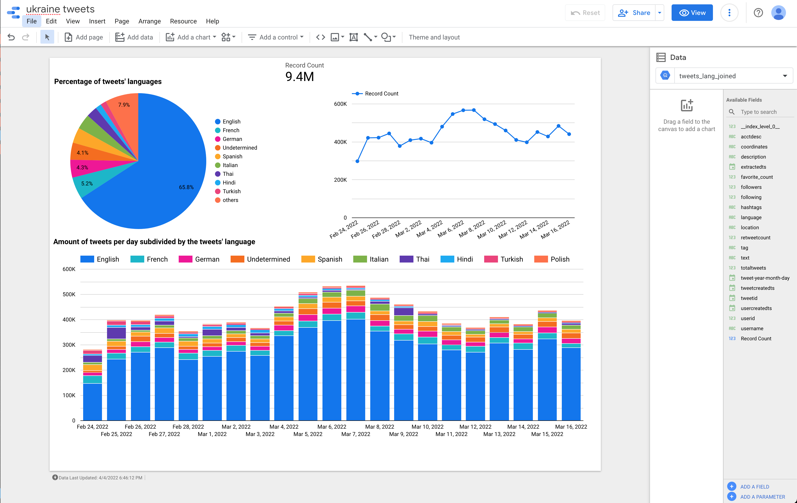

# Overview of Project Criteria

## Problem description

Using the [Ukraine tweets dataset from Kaggle](https://www.kaggle.com/datasets/bwandowando/ukraine-russian-crisis-twitter-dataset-1-2-m-rows).

### Question/goal:

- What does the distribution of languages of tweets related to ukraine in the
  last month look like?

## Cloud

- Terraform is used to create a Google Cloud Storage bucket and Google BigQuery dataset.
- Google Cloud Storage is used to store the `.csv.gzip` and `.parquet` files
- Google BigQuery is used as database to create tables and query the data

### Some screenshots of the data on GCP

#### Google Cloud Storage

#### Google BigQuery

## Data ingestion (choose either batch or stream)

Batch / Workflow orchestration

### Airflow is used with a couple DAGs

1. First DAG to download the datasets and store both the `.csv.gzip` and `.parquet` files on Cloud Storage.
2. Second DAG to create an external table in BigQuery using the `.parquet`
   files stored on Cloud Storage.

## Data warehouse

Google Big Query is used for data warehousing.
The `tweets` and `language-tags` tables are stored there.

## Transformations

`dbt` is used to join the tweets table with the language tags-description
tables to have the full language name for each tweet, e.g. "English" instead of
the abbreviated tag "en", or "French" instead of "fr".
The joined tabled (including the full language name) is stored on BigQuery.

## Dashboard

Made using Google Data Studio.

For higher quality image, see the `.pdf` file in the same directory as this
README.

## Reproducibility

The Python third party library requirements are listed in `requirements.txt`.
The `scrips/*.py` files should be able to run with those.
The terraform, airflow and dbt should be able to be run the same way as done in
previous weeks of the course.
Of course user specific configuration like the Google Project ID should be
given.
